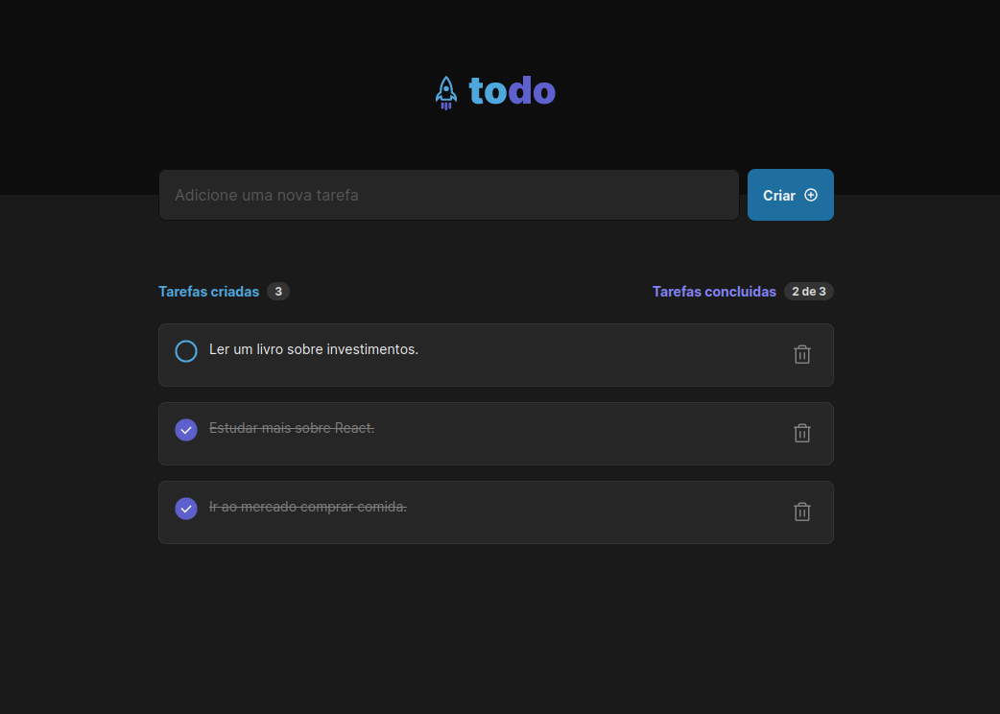
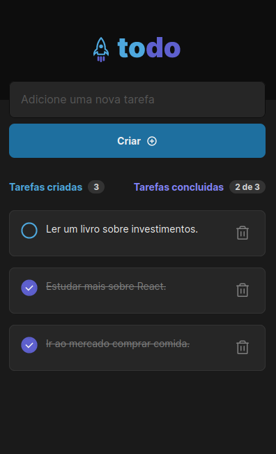

<p align='center'></p>
<h1 align='center'>ToDo</h1>
<p align='center'>


</p>

## 🔖 Descrição
<p>📋 Criação de uma aplicação ToDo, para criação e organização de tarefas a serem realizadas. <a href="https://rocketseat-ignite-react2022-desafio1-todo.vercel.app/" target="_new">Clique aqui</a> para visualizar a aplicação.<p>

## 🚀 Tecnologias
Esse projeto está utilizando as seguintes tecnologias:
- HTML
- CSS
- JavaScript
- [ViteJS](https://vitejs.dev/)

## 🎲 Como utilizar
```bash
# Clone esse repositório
$ git clone https://github.com/rafaasimi/rocketseat-ignite-react2022.git

# Navegue até o repositório
$ cd rocketseat-ignite-react2022/projeto_1/desafios/todo-list

# Instale as dependências
$ npm install

# Execute a aplicação
$ npm run dev
```
<h3>🖼 Layout</h3>



## 📝 Licença
<p>O projeto se encontra sob licença MIT. Para mais detalhes, acesse <a href='LICENSE'>license<a>.</p>

---
<p>Criado com 💙 por <a href='https://github.com/rafaasimi/' target='_blank'>Rafael Simionato</a></p>