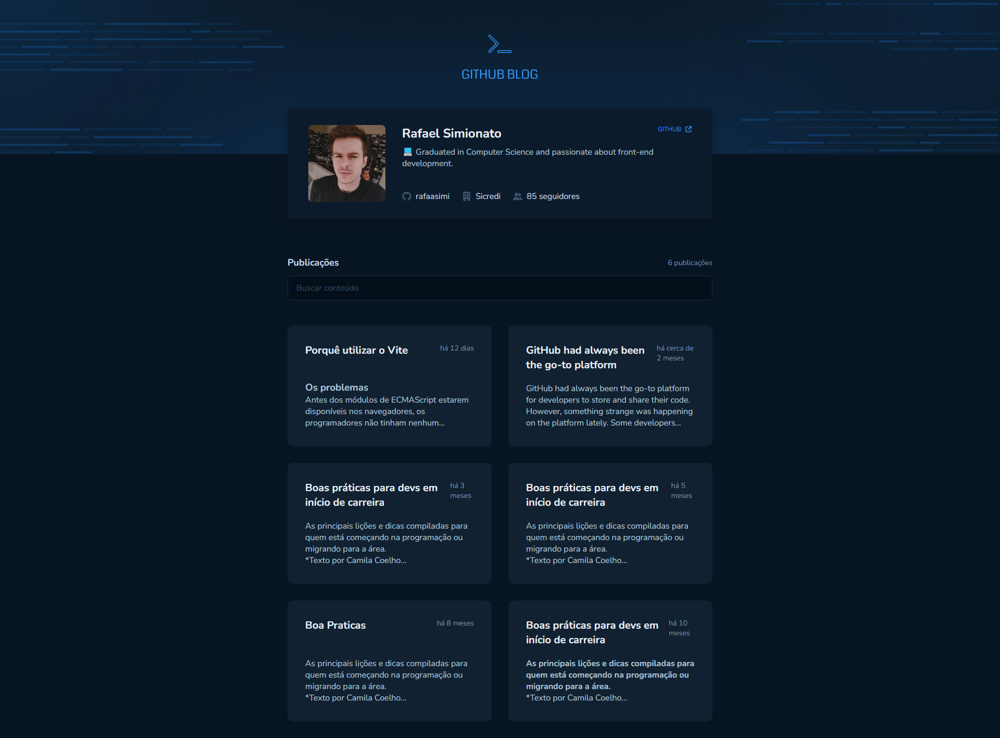
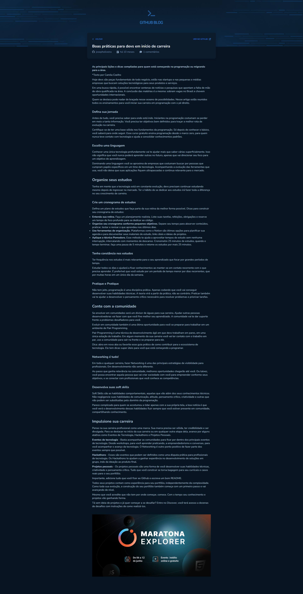

<p align='center'></p>
<h1 align='center'>Github Blog</h1>
<p align='center'>


</p>

## 🔖 Descrição
<p>📋 Criação de uma aplicação de blog, utilizando as issues de um repositório git como posts da página, podendo visualizar o conteúdo, autor, comentários e outras informações..

## 🚀 Tecnologias
Esse projeto está utilizando as seguintes tecnologias:
- HTML
- CSS
- JavaScript
- [ViteJS](https://vitejs.dev/)
- [React Hook Form](https://react-hook-form.com/)
- [Styled-components](https://styled-components.com/)

## 🎲 Como utilizar
```bash
# Clone esse repositório
$ git clone https://github.com/rafaasimi/rocketseat-ignite-react2022.git

# Navegue até o repositório
$ cd rocketseat-ignite-react2022/projeto_3/desafios/github-blog/

# Instale as dependências
$ npm install

# Execute a aplicação
$ npm run dev
```
<h3>🖼 Layout</h3>




---
<p>Criado com 💙 por <a href='https://github.com/rafaasimi/' target='_blank'>Rafael Simionato</a></p>