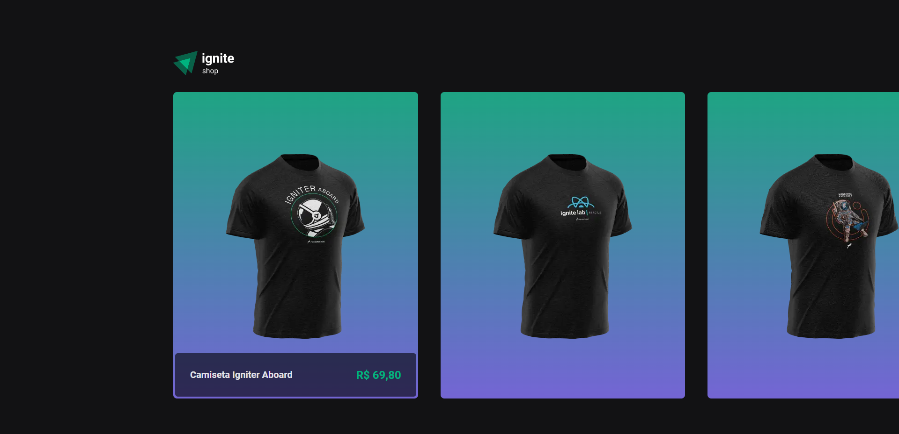
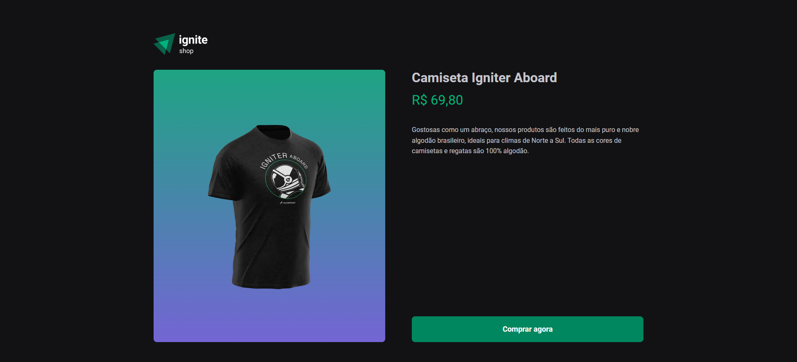
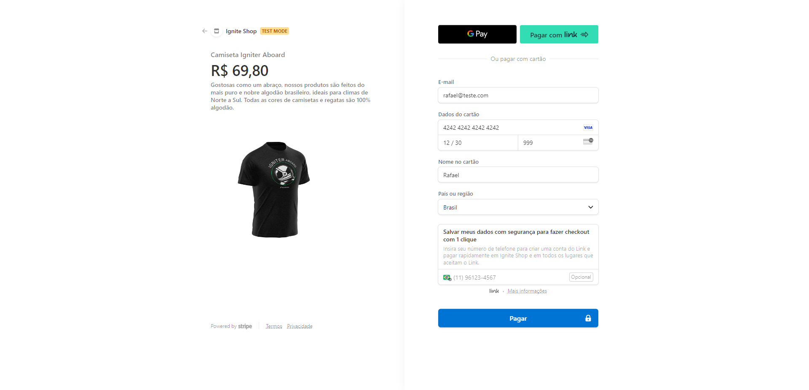

<p align='center'></p>
<h1 align='center'>Ignite Shop</h1>
<p align='center'>


</p>

## 🔖 Descrição
<p>🙋‍♂️ Criação de uma aplicação para venda de produtos. Intregração com a plataforma de pagamentos do Stripe para cadastro de produtos e checkout.

## 🚀 Tecnologias
Esse projeto está utilizando as seguintes tecnologias:
- HTML
- CSS
- JavaScript
- [NextJS](https://nextjs.org/)
- [Stitches](https://stitches.dev/)
- [Stripe](https://stripe.com/br)

## 🎲 Como utilizar
```bash
# Clone esse repositório
$ git clone https://github.com/rafaasimi/rocketseat-ignite-react2022.git

# Navegue até o repositório
$ cd rocketseat-ignite-react2022/projeto_4/04-ignite-shop/

# Instale as dependências
$ npm install

# Execute a aplicação
$ npm run dev
```
<h3>🖼 Layout</h3>





---
<p>Criado com 💙 por <a href='https://github.com/rafaasimi/' target='_blank'>Rafael Simionato</a></p>